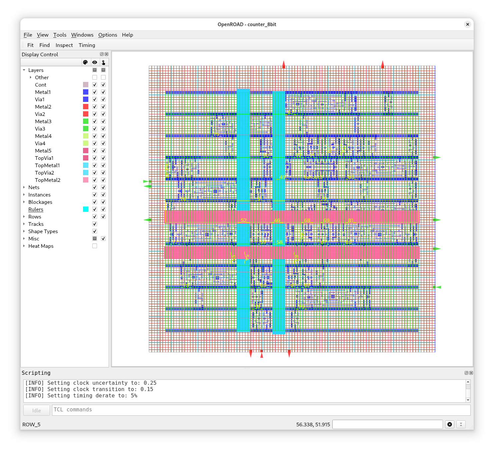
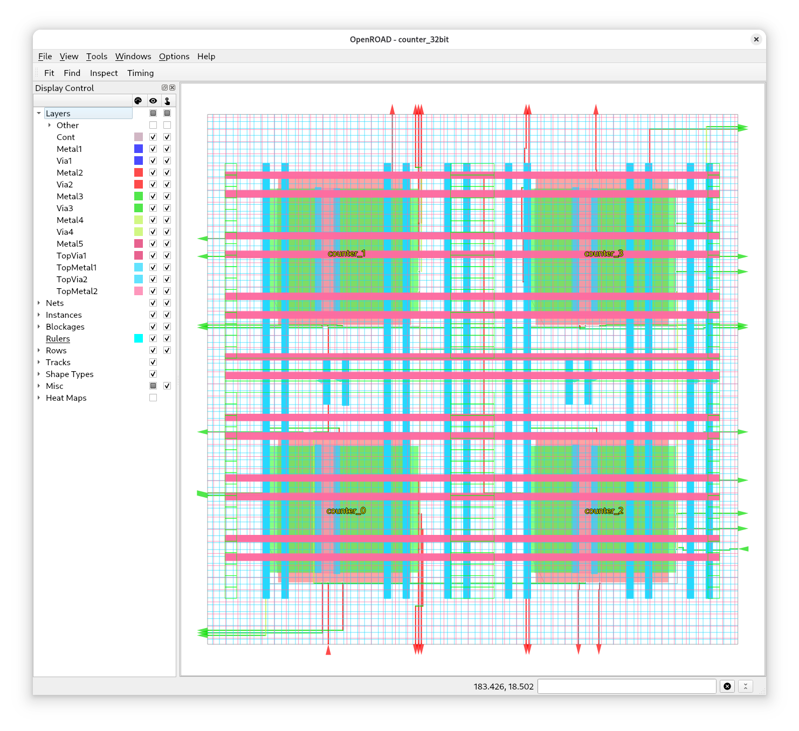
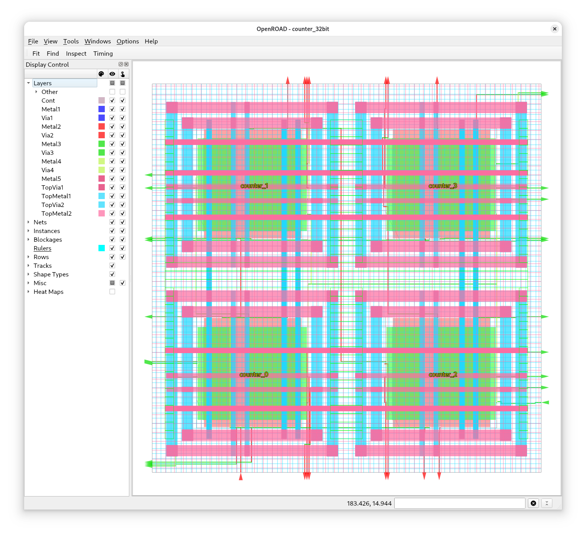

# Exercise 4 - Using Macros

Hard macros are pre-implemented IPs with a dedicated function that you can use in your design. You can implement your own macros, or use the ones provided by the PDK such as IO cells, SRAM macros, analog IPs maybe, etc.

This exercise shows you how to create your own macro and subsequently use it in another design.

## 4.1 - Creating a Macro

Change your current working directory to `counter_8bit`:

```
cd counter_8bit
```

First we need to decide on an integration method for the macro.
We need to ensure that we can connect the macro to the top-level PDN (Power Distribution Network). As we have only a single voltage domain this should be quite simple: we only have to care for the VPWR and VGND pins.

The GF180MCUD PDK has five metal layers dedicated for routing (Metal1-Metal5) and no dedicated top metal layers like IHP SG13G2. 

By default LibreLane will create horizontal power straps using Metal4 and vertical power straps using Metal5. You can see them here in blue and red:



To integrate the macro into a top-level design we need to choose one of several methods. You can read more about them here: [Power Distribution Networks](https://librelane.readthedocs.io/en/latest/usage/pdn.html)

**Hierarchical Method**: By using this method, each macro uses one less metal layer than the previous level. Since we only have our top-level and the macro, this means that we only use up to Metal4 for the macro. The macro is then integrated by placing vertical Metal5 straps across the macro in the top-level and dropping vias where Metal4 and Metal5 overlap (for the correct net).

**Ring Method**: This method creates a power ring around your macro consisting of Metal4 and Metal5. With this method you don't lose any metal layers in your macro, however, it takes more area to implement the ring method.

You need to choose one of the two methods. 3... 2... 1... okay and off you go.

If you chose the hierarchical method you need to restrict the maximum routing layer to Metal4 and set the PDN to only use a single layer (Metal4).

```yaml
# Don't use Metal5 layer
PDN_MULTILAYER: false
RT_MAX_LAYER: Metal4
```

If you chose the ring method, you only need to enable the core ring:

```yaml
# Enable the core ring
FP_PDN_CORE_RING: true
```

Finally, implement the design:

```
librelane --pdk gf180mcuD config_gf180.yaml
```

Great! Once that is done copy the `final/` directory with all its contents from the last run directory (`runs/<timestamp>/final/`) into the `counter_8bit` folder (`counter_8bit/final/`).

You've created your first macro.

## 4.2 - Integrating a Macro

The top-level design is a 32-bit counter made up of four 8-bit counters, our macro. How do we integrate the macro instances?

As it will, LibreLane has a guide handy: [Using Macros](https://librelane.readthedocs.io/en/latest/usage/using_macros.html)

Most importantly, we need to tell LibreLane where to find the macro. Unfortunately, the macro consists of a number of files, which we need to specify individually:

```yaml
MACROS:
  counter_8bit:
    gds:
      - dir::counter_8bit/final/gds/counter_8bit.gds
    lef:
      - dir::counter_8bit/final/lef/counter_8bit.lef
    nl:
      - dir::counter_8bit/final/nl/counter_8bit.nl.v
    lib:
      nom_typ_5v00_25C:
        - dir::counter_8bit/final/lib/nom_typ_5v00_25C/counter_8bit__nom_typ_5v00_25C.lib
      nom_fast_5v50_m40C:
        - dir::counter_8bit/final/lib/nom_fast_5v50_m40C/counter_8bit__nom_fast_5v50_m40C.lib
      nom_slow_4v50_125C:
        - dir::counter_8bit/final/lib/nom_slow_4v50_125C/counter_8bit__nom_slow_4v50_125C.lib
    spef:
      nom:
        - dir::counter_8bit/final/spef/nom/counter_8bit.nom.spef
    instances:
      counter_0:
        location: [20, 20]
        orientation: N
      counter_1:
        location: [20, 105]
        orientation: N
      counter_2:
        location: [105, 20]
        orientation: N
      counter_3:
        location: [105, 105]
        orientation: N
```

The instances key specifies the instances of the macro in the top-level design with their coordinates and orientation.

We also have to tell LibreLane that the `VPWR` and `VGND` pins of the macros should be connected to the `VPWR` and `VGND` nets at the top-level:

```yaml
PDN_MACRO_CONNECTIONS:
  - "counter_0 VPWR VGND VPWR VGND"
  - "counter_1 VPWR VGND VPWR VGND"
  - "counter_2 VPWR VGND VPWR VGND"
  - "counter_3 VPWR VGND VPWR VGND"
```

If you run the flow now, you will probably get an error during PDN generation. The issue is that the pitch between the PDN straps at the top-level is too large to reliably connect the macros.

Therefore, we simply reduce the PDN pitch:

```yaml
FP_PDN_VPITCH: 20
FP_PDN_HPITCH: 20
```

Other noteworthy variables are `FP_PDN_VWIDTH`/`FP_PDN_HWIDTH` and `FP_PDN_VSPACING`/`FP_PDN_HSPACING`.

Now, let's run the flow at the top-level (in `exercise_4/`):

```
librelane --pdk gf180mcuD config_gf180.yaml
```

LibreLane should complete successfully and you should be presented with one of the two results:

| Hierarchical Method | Ring Method |
|--------------------|--------------------|
|  |  |

## Bonus - GF180MCU SRAM

As a bonus task, you can try to integrate an SRAM macro from the GF180MCU PDK. Why use an SRAM? For large memories, SRAM is much more efficient area-wise than a memory made of flip-flops or latches.

> [!NOTE]
> Remember, the PDK is stored under `~/.ciel`. Take a look at the `libs.ref/gf180mcu_fd_ip_sram/` directory for an overview of the available SRAM macros.

You can use this configuration as a reference:

```yaml
MACROS:
  gf180mcu_fd_ip_sram__sram512x8m8wm1:
    gds:
      - pdk_dir::libs.ref/gf180mcu_fd_ip_sram/gds/gf180mcu_fd_ip_sram__sram512x8m8wm1.gds
    lef:
      - pdk_dir::libs.ref/gf180mcu_fd_ip_sram/lef/gf180mcu_fd_ip_sram__sram512x8m8wm1.lef
    nl:
      - pdk_dir::libs.ref/gf180mcu_fd_ip_sram/verilog/gf180mcu_fd_ip_sram__sram512x8m8wm1.v
    lib:
      nom_typ_5v00_25C:
        - pdk_dir::libs.ref/gf180mcu_fd_ip_sram/lib/gf180mcu_fd_ip_sram__sram512x8m8wm1__tt_025C_5v00.lib
    instances:
      top.sram:
        location: [50, 50]
        orientation: N

PDN_MACRO_CONNECTIONS:
  - "top.sram VDD VSS VDD VSS"
```

Good luck!
